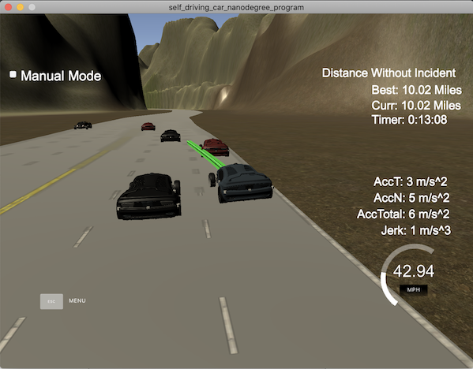

# CarND-Path-Planning-Project
Self-Driving Car Engineer Nanodegree Program

### Goals

The goal of this project is to safely navigate the ego vehicle around a virtual highway with other traffic that is driving +/-10 MPH of the 50 MPH speed limit **without incidents**. To achieve this, a path planner is implemented in C++ and tested with a virtual simulator.


## Basic Build Instructions

1. Clone this repo.
2. Make a build directory: `mkdir build && cd build`
3. Compile: `cmake .. && make`
4. Run it: `./path_planning`

## Build Dependencies

* cmake >= 3.5
  * All OSes: [click here for installation instructions](https://cmake.org/install/)
* make >= 4.1
  * Linux: make is installed by default on most Linux distros
  * Mac: [install Xcode command line tools to get make](https://developer.apple.com/xcode/features/)
  * Windows: [Click here for installation instructions](http://gnuwin32.sourceforge.net/packages/make.htm)
* gcc/g++ >= 5.4
  * Linux: gcc / g++ is installed by default on most Linux distros
  * Mac: same deal as make - [install Xcode command line tools](https://developer.apple.com/xcode/features/)
  * Windows: recommend using [MinGW](http://www.mingw.org/)
* openssl = 1.0.0 (only 1.0.0 is compatible with the uWebSockets commit `e94b6e1`)
  * Mac: latest version of the open ssl (i.e. v1.1.0 or above **does not work** with the Udacity's simulator)
  
```shell  
brew uninstall openssl # if openssl previously installed
brew uninstall openssl # if openssl previously installed
brew install https://github.com/tebelorg/Tump/releases/download/v1.0.0/openssl.rb
```
* [uWebSockets](https://github.com/uWebSockets/uWebSockets) commit `e94b6e1`
  * Run either `install-mac.sh` or `install-ubuntu.sh`.
  * If you install from source, checkout to commit `e94b6e1`, i.e.
    ``` shell
    git clone https://github.com/uWebSockets/uWebSockets 
    cd uWebSockets
    git checkout e94b6e1
    ```

## External Libraries

* [Spline library](https://github.com/ttk592/spline/) Git commit `619c634`. Useful curve fiting library. It is used for creating smooth trajectories.
* [Eigen 3.3](http://eigen.tuxfamily.org/index.php) C++ template library for linear algebra: matrices, vectors, numerical solvers, and related algorithms. Used for the quintic solver for Jerk Minimization Trajectory calculation.


### Simulator
You can download the Term3 Simulator which contains the Path Planning Project from the [releases tab](https://github.com/udacity/self-driving-car-sim/releases/tag/T3_v1.2).  

To run the simulator on Mac/Linux, first make the binary file executable with the following command:
```shell
sudo chmod u+x {simulator_file_name}
```

### Incident types

| Incident                     	|                            Description                           	|
|------------------------------	|:----------------------------------------------------------------:	|
| Collision                    	| The car comes into contact with any of the other cars on the road 	|
| Exceeding Speed Limit        	|          The car drives beyond the speed limit (>50 MPH)           	|
| Exceeding Acceleration Limit 	|       The car drives above the acceleration limit (>10m/s^2)      	|
| Exceeding Jerk Limit         	|           The car drives above the jerk limit (>50m/s^3)          	|
| Out of lane                   | The car spends more than 3 sec outside the lane lines during changing lane changes |

Acceleration both in the tangential and normal directions is measured along with the jerk, the rate of change of total Acceleration. The (`x`,`y`) point paths that the planner recieves **should not have a total acceleration that goes over 10 m/s^2**, also the jerk **should not go over 50 m/s^3**. Currently jerk is over a .02 second interval, it would probably be better to average total acceleration over 1 second and measure jerk from that.

### Terminology

- **Ego vehicle** is the main car on the road that we specify the navigation to safely navigate around the traffic without colliding other cars. 
- **Other vehicle** is the other/non-ego car on the road that we are trying to avoid the collision from.
- **Leading vehicle** is the car that is ahead of the ego vehicle, usually it is in the same lane with the ego vehicle.
- **Target vehicle** is the target car state that can be used to plan the vehicle trajectory from its current position.

- **[Frenet s-d coordinates](https://en.wikipedia.org/wiki/Frenet–Serret_formulas)**, a map coordinate that can be used to reference the vehicle position by the position in the direction the lane, `s` and the perpendicular position to the lane, `d`
- **[Waypoint](https://en.wikipedia.org/wiki/Waypoint)** is an intermediate point where the ego vehicle must drive pass.
- **Path point** is a path planning point where the ego vehicle is intended to drive pass along toward a waypoint.

- **Prediction** is a future state of the other car/non-ego car at a particular point of time.
- **Trajectory** is a collection of vehicle kinematics (i.e. position, velocity, acceleration) of a car while driving

- **Jerk** is the change of acceleration over time. This is useful to measure the rate of acceleration. For example, a sudden change in acceleration will result in high jerk which cause feeling of uncomfort. The maximum jerk allow in this project is 10m/s^3
- **Jerk Minimized Trajectory, JMT** is the smooth vehicle trajectory that has the lowest average values of acceleration and jerk. 
- **[Finite State Machine](https://en.wikipedia.org/wiki/Finite-state_machine), FSM** can be used to represent the vehicle state on the road. For example, it can be keeping lane (`KL`), lane change to left (`LCL`), prepare to lane change to right (`PLCR`)

### Project Introduction

In this project, the ego vehicle's localization data and other vehicles' sensor fusion data, as well as a sparse map list of waypoints around the highway will be provided by [Udacity's highway driving simulator](https://github.com/udacity/self-driving-car-sim/releases/tag/T3_v1.2).
 
Ideally the ego vehicle should drive close to the highway speed limit (50 MPH) whenever that is safe. In other words, which means the ego vehicle passing slower traffic when possible. Note that other vehicles can try to change lanes too. So the ego vehicle should avoid hitting other cars at all cost, as well as driving inside of the marked road lanes at all times, unless going from one lane to another. 

The car should be able to make one complete loop around the 6946m (or 4.32 miles) highway. Since the car is trying to go 50 MPH, it should take a little over 5 minutes to complete 1 loop. Also the car should not experience total acceleration over 10 m/s^2 and jerk that is greater than 10 m/s^3.

## Overview of the Path Planner algorithm



1. Read and load the highway waypoints (for the ego vehicle)
2. Connect to vehicle simulator via `uWebSockets` and parse the ego vehicle object and the waypoints to the `onMessage` event function. During the `onMessage` event/communication with the vehicle simulator, do the following steps.
3. Read in the sensor fusion data of other vehicles received from the simulator.
4. Create a `coarse_waypoints_s` Frenet interpolated waypoints around the ego vehicle, say +/-5 around the ego vehicle. Also create `interpolated_waypoints_x` and `interpolated_waypoints_y`.
5. Determine the ego vehicle kinmatics in global map coordiante first, then convert them to Frenet coordinate using the coarse Frenet s waypoints and the interpolated x&y waypoints from the last step.
6. For each other vehicle sensor fusion data, generate prediction of the projected kinematics at a given `traj_start_time` and `duration`.
7. Check for nearby vehicles to the ego vehicle (to the front, left and right)
8. Create a list of possible successor `states` for the target vehicle that are safe to execute (i.e. keep lane, change lane to left/right, prepare change left to left/right)
9. For each possible successor `state`, find the (ego) vehicle target kinematics in Frenet (i.e. position, velocity and acceleration), then `generate_trajectory_path_for_target` based on the current and target ego vehicle kinematics, use it to `calculate_cost` for the trajectory.
10. Find the (ego) vehicle target kinematics with the lowest cost
11. Create a smooth coarse (ego) vehicle trajectory using `spline` that are based on the last two points of the previous path from the last run, and the two projected target (ego) vehicle positions: current vehicle positions +30 meters and +60 meters respectively.
12. Create an interpolated Frenet s trajectory based on the (ego) vehicle target kinematics
13. Calculate the equivalent (ego) vehicle interpolated x and y trajectory using the previously created coarse and interpolated Frenet s trajectory
14. Create a new list of (x,y) points in global map coordinate from the previous path and interpolated x and y trajectory
14. Send the list of (ego) vehicle target (x,y) points to the vehicle simulator using `uWebSockets`

#### Highway Driving Finite State Machine

| Abbreiation 	|       Vehicle State       	|
|-------------	|:-------------------------:	|
| KL          	|         Keep Lane         	|
| LCL         	|      Lane Change Left     	|
| LCR         	|     Lane Change Right     	|
| PLCL        	|  Prepare Lane Change Left 	|
| PLCR        	| Prepare Lane Change Right 	|

#### Highway Driving Cost Function

|      Cost Function      	|                        Purpose                       	| Weight 	|
|:-----------------------:	|:----------------------------------------------------:	|--------	|
| Collision Cost          	|    Binary cost function that penalizes collisions    	| 99999  	|
| In Lane Buffer Cost     	| Penalize getting close to other vehicles in the lane 	| 1000   	|
| Efficiency Cost         	|              Reward high average speeds              	| 1000   	|
| Buffer Cost             	|       Penalize getting close to other vehicles       	| 100    	|
| Out of Middle Lane Cost 	|        Penalize not staying in the middle lane       	| 100    	|

To guide the path planner to make a better decision on deciding the best trajectory/path to take based on the list of possible states generated by `successor_states()` using the logic of finite state machine (FSM). A number of cost functions were used to calculate the each individual cost of the trajectory. The sum of costs from the above  cost functions for a given successor state is calculated. Then the ego vehicle trajectory is selected that is associated with the lowest costs.

With each cost function, there is a `weight` factor that is added to the cost calculation. The weight factor allows us to tune the relative costs/penalty of the each possible trajectory. The value of the weight values are listed as above and ranked from the highest to the lowest. The cost function such as collision cost carries the heaviest weight, obvisouly for safety reason because this is the single most important objective that the car must meet.

*Sensitivty to initiate the lane change lane*

Then there are other factors such as how close is the ego vehicle near the `leading_car` in the ego vehicle's intended lane, which is reflected by `in_lane_buffer_cost()`. The distance to the `leading_car` is determined by `get_nearest_leading_car_for_lane()`. `efficiency_cost()` that encourage the vehicle to drive as close to the speed limit. `Buffer Cost()` that penalize getting too close to other nearby vehicles `check_nearby_cars()`. These three cost functions influences how likely the ego vehicle decides to initiate to change lane. 

*Sensitivty to return to the middle lane*

With `out_of_middle_lane_cost()` cost function, that influences the sensitivty to return back to the middle lane after the lane change.

### Working with the vehicle simulator

#### Usage of SI and imperial units

The units for the (`x`,`y`) points are in [meters] and the spacing of the points determines the speed of the car in [m/s]. The angle of the ego vehilce can be determined by the vector of going from a point to the next point in the list.

#### Simulator data update every 0.02 second

In the simulator, the ego vehicle uses a perfect controller and will visit every (`x`,`y`) point it recieves in the list every `0.02` seconds. 

#### Dealing with latency between the path planner and simulator

Due to the latency in socket communication between the simulator running and the path planner returning a path, up to 3 time steps (0.06 sec) latency is expected even with an optimized code. During this delay, the simulator will continue using points that it was last given, therefore the last two points from the previous path is stored to ensure a smooth path transition.

Two possible options are to:

- return a path that extends this previous path, or make sure to 
- create a new path that has a smooth transition with this last path

To take advantage of the best possible smooth path transition, both of the above two techniques are implemented in the code.

### More about the data and variables

#### Waypoints of the highway map (`data/highway_map.txt`)

Each waypoint in the list contains `[x,y,s,dx,dy]` values. x and y are the waypoint's map coordinate position, the `s` value is the distance along the road to get to that waypoint in meters, the `dx` and `dy` values define the unit normal vector pointing outward of the highway loop.

The highway's waypoints loop around so the Frenet s value, distance along the road, goes from `0` to `6945.554` meters, that is equivalent approx 4.32 miles.

Here is the data provided from the [highway driving simulator](https://github.com/udacity/self-driving-car-sim/releases/tag/T3_v1.2) to the path planning C++ program.

#### Ego car's Localization Data (No Noise)

- ["x"] The ego car's x position in map coordinates
- ["y"] The ego car's y position in map coordinates
- ["s"] The ego car's s position in Frenet coordinates
- ["d"] The ego car's d position in Frenet coordinates
- ["yaw"] The ego car's yaw angle in the map
- ["speed"] The ego car's speed in MPH

#### Previous path data given to the Planner

//Note: Return the previous list but with processed points removed, can be a nice tool to show how far along
the path has processed since last time. 

- ["previous_path_x"] The previous list of x points previously given to the simulator
- ["previous_path_y"] The previous list of y points previously given to the simulator

#### Previous path's end s and d values 

- ["end_path_s"] The previous list's last point's frenet s value
- ["end_path_d"] The previous list's last point's frenet d value

#### Sensor Fusion Data

Sensor fusion data is a list of all other (non-ego) car's attributes on the same side of the road. (No Noise)

["sensor_fusion"] A 2d vector of cars and then that car's

- ["id"] car's unique ID
- ["x"] car's x position in map coordinates
- ["y"] car's y position in map coordinates 
- ["vx"] car's x velocity in m/s
- ["vy"] car's y velocity in m/s 
- ["s"] car's s position in frenet coordinates 
- ["d"] car's d position in frenet coordinates

#### Vehicle Kinematics in Frenet (s-d coordinates)

- ["s"]      The ego car's s position in Frenet coordinates
- ["s_dot"]  The ego car's s velocity in Frenet coordinates
- ["s_ddot"] The ego car's s acceleration in Frenet coordinates
- ["d"]      The ego car's d position in Frenet coordinates
- ["d_dot"]  The ego car's d velocity in Frenet coordinates
- ["d_ddot"] The ego car's d acceleration in Frenet coordinates
